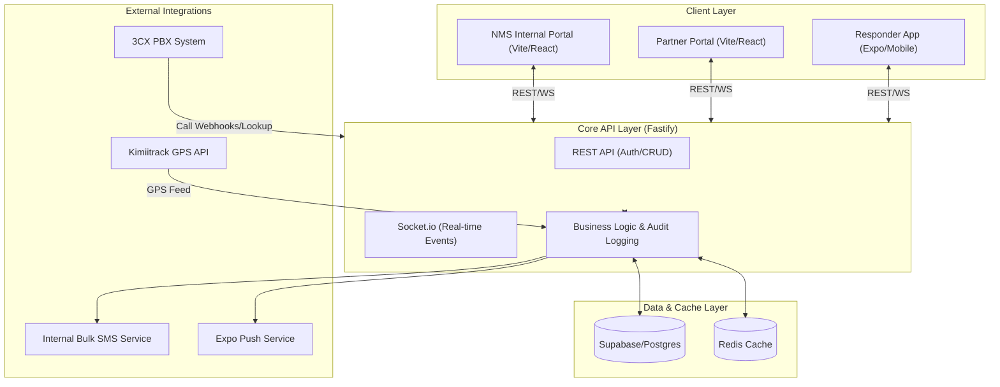

# NMS-EOC Technical Implementation Plan

This document provides a comprehensive technical strategy and granular development roadmap for rebuilding the NMS Emergency Operations Center (EOC) system.

## 1. Technology Stack & Tools

The system is built on a modern, type-safe stack designed for high-concurrency real-time operations.

### Backend (The Core)
- **Framework**: Fastify (Node.js) with TypeScript.
- **ORM**: Prisma for type-safe database access.
- **Real-time**: Socket.io for bidirectional communication.
- **Validation**: Zod for runtime schema validation.
- **Logging**: Pino for high-performance structured logging.
- **Documentation**: Swagger/Scalar for automated API docs.

### Frontend (Web & Mobile)
- **Web**: Vite + React for Internal and Partner Portals.
- **Mobile**: Expo + React Native for Responder App.
- **Styling**: Tailwind CSS (Web) and NativeWind (Mobile).
- **State Management**: TanStack Query (React Query) for server state.

### Infrastructure & Services
- **Database**: Supabase (PostgreSQL) with PostGIS extension.
- **Auth**: Supabase Auth integrated with JWT.
- **Cache/Real-time**: Redis for location caching and Socket.io scaling.
- **Notifications**: Expo Push Notifications Service.
- **Monitoring**: Sentry for error tracking and performance monitoring.

## 2. System Architecture & Data Flow



## 3. System Architecture Details

The system consists of four primary digital products:
- **Core API Service**: Fastify backend with Socket.io and Prisma.
- **NMS Internal Portal**: Vite/React web app for Watchers, Dispatchers, and Admins.
- **Partner Portal**: Independent Vite/React web app for external agencies to manage forwarded cases.
- **Responder App**: Expo (React Native) mobile app for Drivers, EMTs, and Nurses.

### Infrastructure
- **Database**: Supabase (PostgreSQL) with PostGIS.
- **Caching**: Redis for real-time location data and session state.
- **Real-time**: Socket.io for bidirectional updates.
- **Notifications**: Firebase Cloud Messaging (FCM) for push notifications.

## 2. User Roles & Responsibilities (from Writeup.MD)

To ensure strict data security and operational efficiency, the system implements a granular Role-Based Access Control (RBAC) model:

- **Super Admin**: Oversees the entire ecosystem. Responsible for agency onboarding (Internal & Partners), system-wide audit log reviews, and high-level performance analytics.
- **Admin**: Manages internal EOC resources. Responsible for personnel management (Watchers, Dispatchers, Responders), fleet maintenance, and facility configuration.
- **Watcher**: The initial point of contact. Responsible for logging chief complaints, patient details, and incident locations, then submitting them to the dispatch queue.
- **Dispatcher**: The operational coordinator. Responsible for triaging incidents, assigning the nearest ambulance/crew, and managing handoffs to Partner agencies.
- **Driver**: Field responder. Responsible for vehicle check-in via the mobile app, providing real-time GPS telemetry, and status updates during the response lifecycle.
- **Partner**: External agency coordinator. Responsible for receiving forwarded cases through the Partner Portal and managing their own independent fleet response.

## 3. Backend Directory Structure
```text
/src
  /config         # Environment variables and static configurations
  /plugins        # Cross-cutting concerns (Prisma, Redis, Socket.io, JWT)
  /modules        # Domain-driven modules
    /auth         # Registration, Login, OTP, RBAC
    /incidents    # Incident lifecycle and watcher workflows
    /dispatch     # Assignment logic and distance calculations
    /handoff      # Partner forwarding and agency coordination
    /tracking     # GPS data ingestion and location caching
    /notifications # Push/SMS/In-app notification logic
  /shared         # Shared schemas, types, and utility functions
    /schemas      # Zod validation schemas
    /types        # TypeScript interfaces and generated types
    /utils        # Formatting, distance helpers, logging
  /app.ts         # Fastify server initialization
  /server.ts      # Entry point
```

## 3. Database Schema (Prisma)

### Enums
- `Role`: SUPER_ADMIN, ADMIN, WATCHER, DISPATCHER, DRIVER, EMT, NURSE, PARTNER
- `AgencyType`: INTERNAL, PARTNER
- `IncidentStatus`: DRAFT, SUBMITTED, DISPATCH_HANDLING, DISPATCH_ON_HOLD, DISPATCHED, RESOLVED
- `TaskStatus`: PENDING, ACCEPTED, AT_SCENE, PATIENT_PICKED, AT_HOSPITAL, COMPLETED, CANCELLED

### Tables
1. **Agencies**: `id`, `name`, `type`, `location`, `contact_info`
2. **Users**: `id`, `email`, `password_hash`, `name`, `phone`, `role`, `agency_id`, `fcm_token`
3. **Incidents**: `id`, `case_number`, `status`, `chief_complaint`, `location_name`, `coordinates` (geometry), `patient_name`, `patient_age`, `patient_gender`, `patient_contact`, `watcher_id`, `dispatcher_id`, `assigned_agency_id`
4. **Tasks**: `id`, `incident_id`, `vehicle_id`, `driver_id`, `emt_id`, `nurse_id`, `status`, `received_at`, `accepted_at`, `scene_arrival_at`, `pick_time`, `facility_arrival_at`, `completed_at`
5. **Vehicles**: `id`, `registration_number`, `imei`, `status`, `agency_id`, `last_lat`, `last_long`
6. **Facilities**: `id`, `name`, `type`, `keph_level`, `coordinates` (geometry)
7. **ForwardingLogs**: `id`, `incident_id`, `from_agency_id`, `to_agency_id`, `reason`, `timestamp`
8. **AuditLogs**:
    - `id`: UUID (Primary Key)
    - `user_id`: UUID (FK -> Users)
    - `action`: String (e.g., CREATE, UPDATE, DELETE, LOGIN, FORWARD)
    - `subject_type`: String (e.g., INCIDENT, TASK, USER)
    - `subject_id`: UUID (The ID of the affected record)
    - `old_values`: JSONB? (Snapshot before change)
    - `new_values`: JSONB? (Snapshot after change)
    - `ip_address`: String
    - `user_agent`: String
    - `timestamp`: DateTime (Default: now)

### Audit Logging Strategy
To ensure accountability across all roles, the system will implement automated activity tracking:
- **Global Interceptors**: A Prisma middleware will automatically capture all `create`, `update`, and `delete` operations.
- **Context Awareness**: The system will extract the current `user_id` and request metadata (IP, Browser) from the Fastify request context for every log entry.
- **Non-Repudiation**: Critical actions like "Forwarding a Case" or "Deleting a User" will be immutable and searchable in the Admin Portal.
- **Performance**: Audit logs will be written asynchronously to ensure logging doesn't slow down the main user experience.

### Detailed Field Specification

#### Incidents
- `id`: UUID (Primary Key)
- `case_number`: String (Unique, e.g., CASE-000001)
- `status`: IncidentStatus Enum
- `chief_complaint`: Text
- `location_name`: String
- `sub_county`: String
- `coordinates`: Geometry (Point)
- `alert_mode`: String (e.g., Radio, Phone)
- `alert_at`: DateTime (Original call time)
- `notifier_details`: JSONB (Array of channels and phone numbers)
- `patient_name`: String?
- `patient_age`: String?
- `patient_gender`: String?
- `patient_nhif`: String?
- `patient_contact`: String?
- `next_of_kin`: String?
- `mass_casualty`: Boolean (Default: false)
- `mass_casualty_count`: Int?
- `watcher_comments`: Text?
- `dispatcher_comments`: Text?
- `dispatcher_challenges`: Text?
- `pre_hospital_management`: Text?
- `watcher_id`: UUID (FK -> Users)
- `dispatcher_id`: UUID? (FK -> Users)
- `assigned_agency_id`: UUID (FK -> Agencies)
- `target_facility_id`: UUID? (FK -> Facilities)
- `hospital_level_required`: Int?

#### Tasks
- `id`: UUID (Primary Key)
- `incident_id`: UUID (FK -> Incidents)
- `vehicle_id`: UUID (FK -> Vehicles)
- `driver_id`: UUID (FK -> Users)
- `emt_id`: UUID (FK -> Users)
- `nurse_id`: UUID (FK -> Users)
- `status`: TaskStatus Enum
- `received_at`: DateTime
- `accepted_at`: DateTime?
- `scene_arrival_at`: DateTime?
- `patient_pick_at`: DateTime?
- `facility_arrival_at`: DateTime?
- `completed_at`: DateTime?
- `rejected_at`: DateTime?
- `cancelled_at`: DateTime?
- `cancel_reason`: String?
- `start_coordinates`: Geometry (Point)?
- `end_coordinates`: Geometry (Point)?

## 4. API & Socket.io Endpoint Map

### REST API (Fastify)
- **Auth**: `POST /auth/login`, `POST /auth/register`, `POST /auth/otp/verify`, `GET /auth/me`
- **Watchers**: `GET /incidents`, `POST /incidents`, `GET /incidents/:id`, `PATCH /incidents/:id/submit`
- **Dispatchers**: 
    - `GET /dispatch/queue` (Pending cases)
    - `POST /dispatch/assign/:id` (Take up case)
    - `POST /dispatch/handoff/:id` (Forward to Partner)
    - `POST /dispatch/task/create` (Assign crew/vehicle)
- **Responders**:
    - `GET /tasks/active`
    - `PATCH /tasks/:id/status` (Update workflow)
    - `POST /tasks/:id/patient-data` (Log vitals/outcome)
- **Partners**:
    - `GET /partner/incidents` (Forwarded cases)
    - `POST /partner/incidents/:id/accept`
- **VoIP (3CX)**:
    - `GET /voip/3cx/lookup` (Caller ID identification)
    - `POST /voip/3cx/journal` (Logging call details)
    - `POST /voip/3cx/event` (Real-time call triggers)

### Socket.io Events
- **Client -> Server**:
    - `location:sync`: Send current GPS from mobile app.
    - `task:update`: Immediate status push from mobile app.
- **Server -> Client**:
    - `incident:new`: New case for Dispatchers.
    - `incident:update`: Status change for Watchers/Admins.
    - `fleet:pos`: Bulk location updates for Map views (Throttled).
    - `notify:push`: Alert for specific users.

## 5. Real-time Architecture (Socket.io)

### Rooms
- `agency:{agencyId}`: Updates relevant to a specific agency.
- `role:{role}`: Targeted notifications for specific roles.
- `incident:{incidentId}`: Live updates for an ongoing case.

### Key Events
- `incident:created`: Alerts Dispatchers of new submissions.
- `incident:forwarded`: Alerts Partner agencies of new handoffs.
- `location:update`: Throttled broadcast of fleet positions for map views.

## 6. External Integrations

- **SMS**: Integration with the **Internal Bulk SMS Service** for automated alerts and OTPs.
- **GPS Tracking**: Polling integration with the **Kimiitrack WebService** (`getLiveData`). Uses a background worker to fetch fleet coordinates every 60 seconds, caches them in Redis, and broadcasts updates via Socket.io.
- **Push Notifications**: Expo Push Notifications Service for responder alerts.
- **VoIP (3CX)**: Integration for automated Caller ID lookup and real-time "One-click Case" pop-ups for Watchers.
- **Maps**: Google Maps or Mapbox for routing and visualization.

## 7. Development Phases

### Phase 1: Core Foundation & Infrastructure
- Initialize Fastify with TypeScript and RBAC middleware.
- Integrate `@fastify/swagger` and `@fastify/swagger-ui` (or Scalar) for automated API documentation.
- Configure Prisma with Supabase and PostGIS support.
- Implement JWT/OTP authentication and agency management.

### Phase 2: Incident & Internal Dispatch Workflow
- Build Watcher incident creation and Dispatcher triage logic.
- **3CX Integration**: Develop the lookup and journaling APIs for automated call handling.
- Implement nearest-vehicle search and automated facility filtering.
- Develop real-time task assignment and Crew notification system.

### Phase 3: Partner Portal & Agency Handoff
- Implement secure case forwarding logic and audit logging.
- Build the independent Partner Portal for external agency dispatch.
- Ensure bidirectional status synchronization between agencies.

### Phase 4: Responder Mobile App (Expo)
- Develop the Expo mobile app for Drivers, EMTs, and Nurses.
- Implement vehicle pairing, check-in, and shift tracking.
- Build the real-time patient treatment and status update forms.

### Phase 5: Real-time Fleet Management
- Develop the GPS ingestion service (Kimiitrack integration).
- Implement Redis-based location caching for high-frequency updates.
- Build the live map broadcast engine for Dispatcher views.

### Phase 6: Reporting, Analytics & TAT
- Develop the automated TAT (Turnaround Time) calculation engine.
- Build PDF/Excel export services for incident summaries and audits.
- Implement administrative dashboards for performance metrics.

### Phase 7: Hardening & Deployment
- Conduct security audits (rate-limiting, Socket.io hardening).
- Perform end-to-end integration and load testing.
- Deploy to production (The linux server we talked about).
